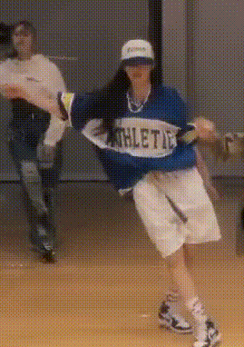

# Girls² Swipe Up ダンスを一部分だけ詳しくみてみる

Girls2 はメンバーそれぞれが個性的な特技や性格を持っています。
彼女らの本分であるダンスを通しても自分らしさを表現しており、ライブに行くと顔がわからなくても動きで誰が誰だかわかります。
（実際には確かめられないので、盛大な勘違いを犯しているかもしれません。）
その中で私は原田都愛のダンスを、末端の細かい動きが大きい、勢いがありかつ軽く感じるという印象を受けて気に入っています。
このようなことをなんとなく感想として抱いていたのですが、もう少し詳しく彼女の動きを知りたいと思い素人ながら動きを可視化し観察してみることにしました。

実はグラフ自体はだいぶ前に作っていたんですが、説明を考えるのを先延ばしにして今に至ります。

<blockquote class="twitter-tweet">
<a href="https://twitter.com/hashtag/%E5%8E%9F%E7%94%B0%E9%83%BD%E6%84%9B?src=hash&amp;ref_src=twsrc%5Etfw">#原田都愛</a> この部分動きが直線的なのが良いよねと主張しようとしたけど、溜詰があって移動が速い＆揃ってるからですかね 全員分やりたかったけど画質的に無理だった <a href="https://t.co/F8yfE90fHx">pic.twitter.com/F8yfE90fHx</a>
&mdash; とらんしー9 (@trncix) <a href="https://twitter.com/trncix/status/1557690375485407233?ref_src=twsrc%5Etfw">August 11, 2022</a></blockquote> 

## 前提

調べる映像は [Girls² - Swipe Up (Dance Practice Video)](https://youtu.be/iDsHPgqQHDg?t=137) の一部分、2:20 からの４拍ほどです。
また、実際に調べたのは桜花、綺羅、都愛の肩＋顔の動きになります。

時間にして2秒ない程度。
そして私は動きの解析やダンスそのものについて全く詳しくありません。
また長い映像・多い人数を処理しきる根性もありませんでした。
ここで私から共有できるのはとても限られた情報です。
そのうえで、短い映像からでも多くのことがわかったと思うのでこの記事を書きます。
ファンなので、だいたい都愛寄りのコメントが多くなると思います。

## グラフの描き方

主に3DCGを作るために使われるソフトウェア [Blender](https://www.blender.org/) を使いました。
Blender には動画内のマーカーを追跡する機能があり、これで桜花、綺羅、都愛の両肩と口の3点づつを追跡しました。
画像上にその軌跡を重ねると次のようになります。
四角いのがマーカーの位置です。

得られた各時刻でのxy座標の、初期値を0とした変位をそれぞれプロットしました。

グレーの縦線は楽曲の拍にあたります。
これは手打ちなのでだいたいです。
青 は 左肩, オレンジ は 右肩, 緑 は 口 を追跡した座標です。
左列、x座標の変位はだいたい 上(画面右)-下(画面左)-真ん中 のように変化しています。
また右列のy座標は個人差が大きいですが3拍目で下に沈み込み、そのあと大きく上にいくような動きです。
つまり体の軌跡としては数字の4をひっくり返したような動きであることがわかり、また映像の通りであることが確かめられます。

> **Note**
> 左右という表現が誰にとってか紛らわしいので、以降は画面上、我々から見た方向での左右ということに決めます。
> メンバーにとっての左右ではありません。
> ただし、右肩・左肩というときは本人にとっての左右を意味することとします。

## 読み取れること

これからグラフをポイントごとに見ていきます。
まず、このデータを観察するうえではグラフの概形に注目することにします。
図形の特徴が横(時間)軸のどこに現れるかを3人の間で比較すると、スピードやタイミングの微妙な違いを知ることができます。
また、各図に3色のグラフがありますが、これらが揃っているかどうかはそのまま上半身の動きが揃っているかを意味します。

メンバー間で縦軸の変化量を比べることはあまり意味がないと思います。
理由は移動するカメラで撮影された映像を使っているため、立ち位置の違いで遠近法の効果がはたらきグラフの縮尺が揃わないからです。
また身長の違いも調整したほうがいいかもしれませんが、よくわからないのでそのままです。
あくまでグラフの曲がり方やタイミングを見ていこうと思います。

これから先は、グラフだけ見るのでなく動画と見比べてみてください。
そして訂正や新しい気づきがあれば教えてほしいです。

### 大まかな特徴

だいたいの動きを赤線でフリーハンドしてみました。

桜花は最初のほうで上下の動きが大きいです（紫）。
基本的に左右が平行に動いていますが、上下の開きが大きい部分もあり、肩の柔らかい動きがわかります。
そのわりに後半では上下の変化は小さいです。

綺羅はかなり滑らかに動いています。
細かい変化が少なく、むしろグラフ全体を横切るようなカーブを描きます。
また桜花と同様に左右の肩でy方向での動きの差も大きく、柔らかさの要素も見えます。

二人に比べると、都愛は3本のグラフが揃っていて上半身が固定されているようです。
また、 xとy がどちらも同じようなところに変化するポイント（紫の時点）があるので、より直線的な感じがします。

### 動きの速さ

都愛の動きは全体的に速いようです。
x方向の動き(左列)で特に差がありますが、山から谷への移り変わりが速く、2拍めで既に上半身が最も左側に到達しています。
動画でも一足早く折り返し点について、次へのタメを作っているような印象を受けました。
ほんとに個人的な感想なんですが、この部分に限らず、都愛はこのような動きを迎えに行く感じが好きで見てて気持ちいいです。
一方、桜花と綺羅は３拍めの手前までかけて左へ移動しています。
全体的に都愛よりなめらかに動いているようです。

y方向(右列) では、3拍目から上にあがる動きがあります。
縦線で示していますが、上に到達する時刻が同じであり、都愛は動き出しが早いためゆっくり昇っているように見えます。
しかし都愛だけに見られる特徴として、その直前で急な下降がみられます。
この部分は傾きからも分かる通り、結構速い動きをしています。

### 部位の連動

各部位の動きをずらすことで、全体として柔らかい、滑らかな動きとなります。
逆にこれらを揃えることは姿勢が変わっていないことを意味します。
綺羅が特徴的だと思うのですが、3色のグラフは凹凸の出てくるタイミングは少しずつずれています。
映像では首がぐねっと潜り込むような動きですごい滑らかさを発揮しており、それが図形としても現れています。

---

対して、ポーズの変化前に予備動作を入れることで勢いを感じさせる箇所があります。
下図の赤で囲ったところは、次の大きな動作と反対に一度動くことでより大きな動きに見せているようにおもいます。
都愛の場合は首のふり幅が大きく、より左右の動きを強調されています。

都愛は半分くらいまでは右肩(オレンジ)の変化量が小さいです（紫,上）。
動画をよくみると右肩を中心に他の部分を引き付けるような様子があります（紫,下）。

## そのほか言いたいこと

何度も見ていて気づきました。
都愛はポーズからポーズに移るときに回転や移動ではなく、位置を入れ替える感じの動きをしているように見えます。
一つ特徴的なところを見つけたので紹介します。

この部分、ダウンという名前がついているくらいですし普通にやると腰を下げるようなイメージで動くと思います。
しかし都愛の場合、膝の向きをあるタイミングで反転させると思った方が自然な気がします。
結果として上半身が急に落ちているという解釈です。

私にダンサーの心は分からないのでほんとに何とも言えないのですが...
少なくとも肘や膝がこのように大きく向きを変えることは、この部分に限らす彼女の特徴としてよく出てきていて、見てて気持ちいいなとおもっています。
なんかこういう特徴のあるジャンルがあるんでしょうか？

## まとめ

ダンスの一部分、また3人の比較だけでもかなり違いがありました。
今回のようなプロットの方法はあまり正しい方法だと思ってませんし、ちょっと大変だったので次はないと思います。
しかし、映像をコマ送りして見るくらいは今後もやると発見があって楽しいかなと思います。
また、今回わかったことを踏まえて全員の動画を見ると、動きがある程度分類できるような漢字がします。
グループ内でダンスにおいてもお互いに影響を与えているはずですが、誰が誰を見ているのかなど考えるのも楽しいです。

## 感想

* 図が多いとたくさん文章を書いた気分になります。
* 見てる側としてもみんな何をどう考えて踊ってるかという作者の気持ちまで考えさせられます。もはや国語。
* もうグラフはやりたくないといったけど、文章だけで伝えるよりは説明しやすかったです。
